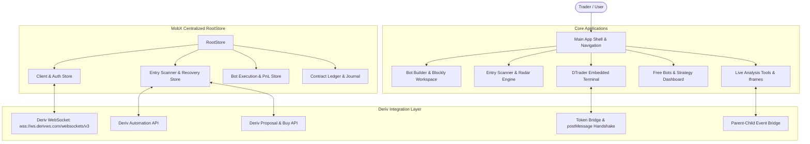
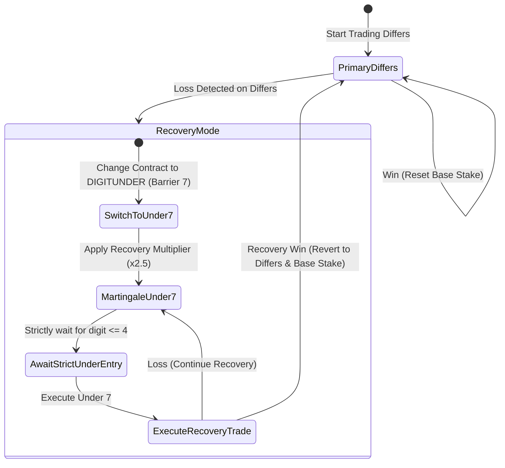

# 🚀 ProfitHub Expert — Master Architecture, UI & API Integration Guide

This document serves as the **definitive engineering and integration manual** for the ProfitHub Expert platform. It covers everything needed to build, update, extend, and safely maintain the application, UI components, WebSocket network layers, Deriv API integrations, and mathematical bot engines.

---

## 📑 Table of Contents

1. [System Overview & Architecture Diagram](#1-system-overview--architecture-diagram)
2. [UI & Design System Guidelines (Strict VIP Standard)](#2-ui--design-system-guidelines-strict-vip-standard)
3. [Deriv WebSocket API & Network Infrastructure](#3-deriv-websocket-api--network-infrastructure)
4. [Multi-Account & Token Bridge Engine](#4-multi-account--token-bridge-engine)
5. [Deriv Native Automation API Integration](#5-deriv-native-automation-api-integration)
6. [Entry Scanner & Algorithmic Engines](#6-entry-scanner--algorithmic-engines)
7. [Third-Party Iframes & Parent-Child Event Bridge](#7-third-party-iframes--parent-child-event-bridge)
8. [Bot Skeleton & Blockly Architecture](#8-bot-skeleton--blockly-architecture)
9. [Developer Maintenance & Safe Update Protocols](#9-developer-maintenance--safe-update-protocols)

---

## 1. System Overview & Architecture Diagram

ProfitHub Expert is a visual trading, algorithmic scanner, and bot automation ecosystem built on **React 18**, **TypeScript**, **MobX**, **Google Blockly**, and **RSBuild**.



### Key Technical Stack

- **Framework**: React 18 with TypeScript.
- **State Management**: MobX 6 (`makeObservable`, `@observable`, `@action`, `runInAction`).
- **Build System**: RSBuild (`rsbuild.config.ts`) with lightning-fast Rspack compiler.
- **Bot Engine**: Google Blockly + Deriv `bot-skeleton` runtime.
- **Styling**: SCSS modules with custom CSS variable tokens, glassmorphism filters, and organic mesh gradients.

---

## 2. UI & Design System Guidelines (Strict VIP Standard)

> [!IMPORTANT]
> **Aesthetic Rule**: The platform uses a **VIP Holographic Glassmorphism** design system. When editing or adding features, **never** replace the glass cards, glowing pearls, circular SVG gauges, or neumorphic tiles with generic flat cards or unstyled standard HTML elements.

### 2.1 Design Tokens (`src/styles/` & Component SCSS)

```scss
// Backgrounds & Surface Filters
--glass-card-bg: rgba(18, 26, 43, 0.75);
--glass-card-border: 1px solid rgba(255, 255, 255, 0.12);
--glass-backdrop-blur: blur(24px) saturate(180%);
--aurora-gradient:
    radial-gradient(circle at 50% -20%, rgba(99, 102, 241, 0.18), transparent 70%),
    radial-gradient(circle at 100% 50%, rgba(236, 72, 153, 0.12), transparent 50%);

// Accent Glows & Colors
--accent-cyan: #00e5ff;
--accent-purple: #8b5cf6;
--accent-green: #10b981;
--accent-red: #ef4444;
--accent-gold: #f59e0b;
```

### 2.2 Entry Scanner UI Elements

1. **VIP Holographic Glass Card**:
    - Animated top header with active scanning radar waves.
    - **Circular SVG Confidence Gauge** indicating live signal match percentage.
    - **Stream Pearl Bar**: Visual bubble sequence displaying live streamed last digits.
    - **Direction & Recovery Badge**: Changes color and label dynamically (e.g. `UNDER 7 (RECOVERY)` in vibrant emerald/purple when recovery is active).
2. **4-Grid Neumorphic Action / Metric Tiles**:
    - `⚡ Quick Trade` (Direct execution trigger with active pulse).
    - `🤖 Load Bot` (Compiles Blockly bot into Builder).
    - `📊 Live Ticks` (Real-time count of captured ticks across all markets).
    - `💰 Total PnL` (Dynamic green/red profit badge).
3. **Multi-Strategy Pill Matrix**:
    - Toggle buttons with glowing borders for `Over / Under`, `Even / Odd`, `Differs`, `Matches`, `Rise / Fall`.

---

## 3. Deriv WebSocket API & Network Infrastructure

### 3.1 WebSocket Connection Endpoint

```
wss://ws.derivws.com/websockets/v3?app_id={APP_ID}&l={LANG}&brand=deriv
```

- **Custom Production App ID**: `121856` (Configurable via `getAppId()` in `src/components/shared/utils/config/config.js` or `.env`).
- **Development App ID**: `1089` (or `36300`).

### 3.2 Authentication Protocol

Authentication is executed via the `authorize` command:

```json
{
    "authorize": "<DERIV_API_TOKEN>",
    "req_id": 1
}
```

**Response handling**:

- Populates `client.loginid`, `client.currency`, `client.balance`, `client.email`.
- Sets active account permissions (`read`, `trade`, `admin`, `payments`).

### 3.3 Live Multi-Market Tick Stream

To power the Entry Scanner across all 13 Volatility Indices simultaneously:

```json
{
    "ticks_history": "1HZ100V",
    "end": "latest",
    "count": 1000,
    "style": "ticks",
    "subscribe": 1
}
```

- Receives initial 1,000 tick history to compute immediate statistical baselines.
- Subscribes to continuous live ticks (`subscribe: 1`) to feed real-time statistical engines.

---

## 4. Multi-Account & Token Bridge Engine

Located at `src/utils/token-bridge.ts`, this engine enables multi-account switching and seamless cross-iframe token distribution.

### 4.1 Token Storage Keys Schema

```ts
// LocalStorage Schema:
'client.accounts'; // JSON map: { "CR123456": { token: "a1-xxx", currency: "USD" }, "VRTC9876": { token: "a1-yyy", currency: "USD" } }
'active_loginid'; // Currently selected account ID string (e.g. "CR123456" or "VRTC9876")
'token1'; // Primary active trading token
'active_token'; // Fallback active token string
'client.loginid'; // Active client login ID
```

### 4.2 Cross-Iframe Token Injection (DTrader & Tools)

1. **URL Query String Synchronization**:
    ```
    https://deriv-dtrader.vercel.app/?app_id=121856&symbol=1HZ100V&theme=dark&hide_header_login=true&is_mobile_app=true&acct1=CR123456&token1=a1-xxx&cur1=USD&acct2=VRTC9876&token2=a1-yyy
    ```
2. **Window `postMessage` Broadcast**:
    ```ts
    const payload = {
        type: 'DERIV_AUTH_PAYLOAD',
        active_loginid: loginId,
        token: authToken,
        accounts: accountsList,
    };
    iframe.contentWindow?.postMessage(payload, '*');
    ```

---

## 5. Deriv Native Automation API Integration

Located at `src/external/bot-skeleton/services/api/automation.js` and wired into `EntryScannerStore`.

### 5.1 Server-Side `auto_start` Protocol

```json
{
    "auto_start": 1,
    "strategy_id": "martingale",
    "contract_template": {
        "underlying_symbol": "1HZ100V",
        "contract_type": "DIGITDIFF",
        "amount": 0.5,
        "basis": "stake",
        "currency": "USD",
        "duration": 1,
        "duration_unit": "t",
        "barrier": "2"
    },
    "strategy_parameters": {
        "multiplier": 2.0,
        "take_profit": 10.0,
        "stop_loss": 50.0,
        "max_stake": 100.0
    },
    "subscribe": 1
}
```

### 5.2 Direct Execution Fallback (`proposal` + `buy`)

If server-side automation is toggled off or unavailable:

1. `proposal`: Sends trade parameters to retrieve active price & quote proposal ID.
2. `buy`: Purchases contract with `proposalId` and `price`.
3. `proposal_open_contract`: Subscribes to contract ID to receive tick-by-tick results and settlement profit.

---

## 6. Entry Scanner & Algorithmic Engines

Located at `src/stores/entry-scanner-store.ts`.

### 6.1 Statistical Signal Analyzers

- **Over / Under**: Analyzes last 50 digits. If $\ge 50\%$ Under $\rightarrow$ Under 7 signal. If $\ge 50\%$ Over $\rightarrow$ Over 2 signal.
- **Even / Odd**: Analyzes parity skew. If $\ge 50\%$ Even/Odd $\rightarrow$ Even/Odd signal.
- **Differs**: Identifies the coldest (least frequent) digit in the 1,000-tick window.
- **Matches**: Identifies the hottest (most frequent cluster) digit.
- **Rise / Fall**: Evaluates tick-to-tick momentum. Signals if direction is $\ge 60\%$.

### 6.2 Strict Entry Confirmation Engine (Sniper Triggers)

Trades are **never** executed instantly upon finding a signal. The store enters `scan_phase = 'waiting_entry'` and only triggers trade execution when the exact mathematical rule is satisfied:

| Strategy                     | Strict Confirmation Rule                                                    | Reason / Edge                                                                                 |
| :--------------------------- | :-------------------------------------------------------------------------- | :-------------------------------------------------------------------------------------------- |
| **Differs (Prediction $X$)** | Cold digit $X$ prints on live stream OR 3 consecutive confirmed safe digits | Statistically optimal: immediate repeat of cold digit has the lowest conditional probability. |
| **Under 7**                  | Live digit prints $\le 4$                                                   | Confirms low-digit momentum before entering Under 7.                                          |
| **Over 2**                   | Live digit prints $\ge 5$                                                   | Confirms high-digit momentum before entering Over 2.                                          |
| **Even / Odd**               | Parity transition (e.g. Odd $\rightarrow$ Even for EVEN)                    | Snipes mean-reversion and parity alternation waves.                                           |
| **Matches (Target $X$)**     | Hot digit $X$ prints on stream                                              | Catches hot digit clustering momentum.                                                        |
| **Rise / Fall**              | 2 consecutive directional momentum ticks                                    | Confirms trend breakout before entry.                                                         |

### 6.3 Differs Loss Recovery & Auto-Revert Engine



### 6.4 Market Rotation Engine (After 5 or 7 Runs)

1. Tracks `current_runs` against `max_runs_before_pause` (default 5 or 7).
2. When limit is reached:
    - Pauses execution and stops active stream/automation run.
    - Enters 4-second cooldown phase (`scan_phase = 'cooldown'`).
    - Calls `runAnalysis(previousSymbol)` which **excludes** the previous market.
    - Automatically selects the next highest-confidence synthetic index.
    - Enters `waiting_entry` on the new market, awaits strict entry confirmation, and resumes.

---

## 7. Third-Party Iframes & Parent-Child Event Bridge

Located at `src/components/iframe-wrapper/iframe-wrapper.tsx` and `src/components/iframe-bridge/`.

### 7.1 Supported Third-Party Analysis & Bot Iframes

- `DTrader Terminal`: `https://deriv-dtrader.vercel.app/`
- `Analysis Tool`: `https://analysisprofithub.vercel.app/`
- `Smart Analysis`: `https://www.smartanalysistool.com/`
- `Deriv Circles`: `https://dcircles-six.vercel.app/`
- `Xenon Tool`: `https://xenontool.netlify.app/`

### 7.2 Real-time Trade Event Forwarding

Iframes dispatch standard postMessage events:

```ts
window.parent.postMessage(
    {
        type: 'TRADE_PLACED', // or 'CONTRACT_EVENT', 'CONTRACT_UPDATE'
        contract_id: 123456789,
        buy_price: 1.0,
        currency: 'USD',
        contract_type: 'DIGITDIFF',
        underlying: '1HZ100V',
        profit: 0.09,
        status: 'won',
    },
    '*'
);
```

`IframeWrapper` catches these messages and forwards them directly to MobX `TransactionsStore` and `RunPanelStore`, updating the live platform PnL and trade log instantly!

---

## 8. Bot Skeleton & Blockly Architecture

Located at `src/external/bot-skeleton/`.

### 8.1 Strategy Categories & Aliases (`constants/config.ts`)

To prevent Blockly `undefined` category errors, all trade types are normalized:

```ts
export const TRADE_TYPE_CATEGORIES = {
    callput: ['call', 'put', 'rise_fall', 'rise', 'fall'],
    overunder: ['over_under', 'high_low', 'digitover', 'digitunder', 'over', 'under'],
    evenodd: ['even_odd', 'digiteven', 'digitodd', 'even', 'odd'],
    matchesdiffers: ['matches_differs', 'digitmatch', 'digitdiff', 'differs', 'matches', 'digits'],
};
```

### 8.2 Loading Bots from Scanner to Builder

`EntryScannerStore.loadBotToBuilderAndRun(autoRun)` translates scanner signals into XML workspaces and passes them to `BlocklyStore`, automatically configuring market, trade type, stake, and duration before starting the bot.

---

## 9. Developer Maintenance & Safe Update Protocols

### 9.1 Adding New Free Bots

1. Place the strategy XML file inside `public/xml-uploads/` (or `dist/xml-uploads/`).
2. Run the manifest generator:
    ```bash
    node scripts/generate-manifest.js
    ```
3. The bot will automatically appear on the Free Bots dashboard with full metadata.

### 9.2 Modifying External URLs

- Update `.env` (e.g. `DTRADER_URL=https://deriv-dtrader.vercel.app`).
- When referencing embedded tools, ensure the base URL does not double-append paths if the app is hosted at root `/`.

### 9.3 Verification & Build Commands

```bash
# Start local development server
npm start

# Run unit tests
npm test

# Build production bundle
npm run build

# Stage and commit
git add .
git commit -m "feat/fix: <description>"
git push origin main
```

---

_ProfitHub Expert Architecture & Integration Guide — Maintained for scalable, high-performance, and safe trading operations._
